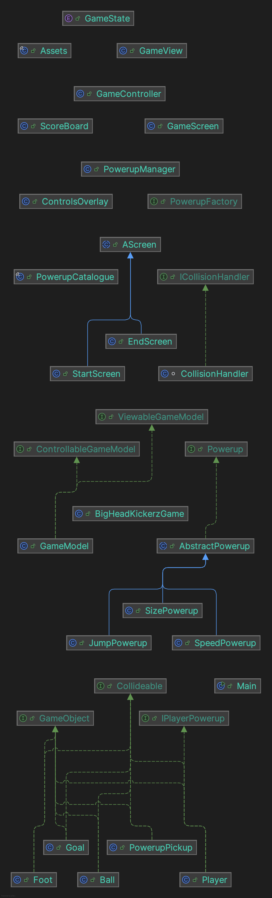

# Rapport – innlevering 4
**Team:** 
*beta krigerne* – *Mikal Arolkar, Andreas Aasheim Farup, Vegard Gjertsen Gonsholt, Olav Hilland Lidal*

## Prosjektrapport

### Rollefordeling
Vi valgte følgende roller i starten av prosjektet:
* Mikal Arolkar: Møteansvarlig 
    * Innebærer å finne tid og sted for møtene vi holder, samt hovedansvar for å skrive møtereferat og oblig.md.
* Andreas Aasheim Farup: Utvikler
    * Innebærer et ansvar for kodestruktur og holde styr på prosjektmetodikken. 
* Vegard Gjertsen Gonsholt: Gruppeleder
    * Innebærer et overordnet ansvar for arbeidsflyten i gruppen og fordeler oppgaver mellom oss.
* Olav Hilland Lidal: Grafisk designer
    * Innebærer et ansvar for det grafiske ved spillet.

Vi synes at rollene har fungert veldig bra gjennom hele prosjektet. Selv om vi har hatt ansvar for ulike områder har alle bidratt med kodingen. Vi synes det har vært spesielt nyttig med en utvalgt gruppeleder og møteansvarlig, da dette har gjort det lettere å holde oversikt over hva som skjer i prosjektet.

### Prosjektmetodikk
Siden innlevering 3 har vi fortsattet med å benytte oss av Kanban i form av git issues og issue boards, og vi opplever at dette har fungert meget godt. Gruppeleder har vært flink på å minne resten av gruppen på å bruke verktøyene aktivt. Det har vært spesielt nyttig å bruke issueboardet aktivt, da dette har gitt oss bedre oversikt over hvem som jobber med hva, samt å holde styr på det som er av uferdige oppgaver.

### Gruppedynamikk
Dynamikken i gruppen har bare vært god. Vi kjenner hverandre godt fra før og kommuniserer godt sammen. Vi snakker sammen regelmessig gjennom gruppechat i discord. Siden forrige innlevering har Mikal kommet seg på lesesalen igjen og hele gruppen har dermed hatt enkelt for å kommunisere med hverandre fysisk også. 
Vi er veldig fornøyd med arbeidet alle har gjort og har ingen uenigheter i arbeidsprossessen. Eventuelle uenigheter i forhold til implementasjon av kode har fort blitt løst med drøfting av løsninger, både i gruppechat og på lesesal.

### Commits
Vegard som gruppeleder og Andreas som "hovedutvikler" har hatt et overordnet ansvar i prosjektet, og har dermed utført flere commits enn Mikal og Olav. Flere av commitsene angår da kodestil, javadocs og annet finpuss.
Olav har hatt hovedsansvar for å utvikle fot og sparke funksjon, og har jobbet mye lokalt med dette. Derav færre commits. 
Det har også vært forskjeller i commits grunnet personlige ulikheter. Spesielt i begynnelsen når vi ikke var vant til å jobbe aktivt med commits. Da jobbet enkelte medlemmer mye lokalt og det ble utført flere større endringer før det ble commitet. Det resulterte altså i færre commits. Dette er imidlertid noe vi også har lært av. Det er viktig å commite hyppig.   
Som nevnt tidligere var Mikal "sykemeldt" en periode grunnet operasjon, og fikk færre commits i den perioden.
Vi har også hatt mye parprogrammering ettersom vi har jobbet på samme lesesal, noe som igjen kan føre til en skjevfordeling av commits.  

### Møtereferater
Møtereferatene består av punkter som omhandler status, avgjørelser og videre tiltak.

Link til møtereferater: https://docs.google.com/document/d/1ZWcazwmUgAseS5O9PUcpke30jC4rHr28SO9JqplW1AA/edit?usp=sharing

### Prosjektet i retrospekt

Vi har lært mye av prosjektet, men har noen punkter vi ville gjort annerledes:

* Følge MVC-prinsippene fra starten av. Hvis vi hadde strukturert prosjektet i henhold til MVC fra starten av, ville vi spart oss for mye tid og knoting. 

  * Modell klassene Player, Foot, Ball og Goal og PowerupPickup utfører "rendering", noe som ikke er ideelt. 

  * Grensesnittene Collideable og GameObject kunne bli slått sammen til en.
* Mer konkrete mål
* Mer struktur rundt møtene
  * Ettersom vi kjenner hverandre godt og sees regelmessig, har møtene ikke blitt så formelle. Vi kunne hatt faste møtetider eller planlagt møter lengre tid i forveien. Istedenfor har vi tatt møter etter behov. 

* Bruke verktøyene vi har tilgang til strukterert fra start.
  * SonarQube, Kanban, gruppeledere

Alt i alt er vi svært fornøyd med prosjektet. Det har vært god dynamikk i gruppen fra start. Det har aldri oppstått noe krangel/problem som ikke har blitt løst umiddelbart.
Til tross for uformelle og uregelmessige møter, har kommunikasjonen og effektiviteten vært god, og dermed har ikke mangel av "formelle" møter påvirket prosjektet i noen negativ grad.

Det har vært lærerikt, kjekt og spennende å jobbe med prosjektet - spesielt når alle i gruppen er like motiverte for å se det komme til live. Vi er stolte og fornøyde med spillet vi har utviklet.

## Krav og spesifikasjon

### Gjennomførte krav siden forrige innlevering
* Vi har implementert fot med ønsket funksjon. Sparket fungerer nå som en pendulum og løfter ballen opp i luften.
* Vi har implementert alle lydeffektene som vi planla. Vi har lagt til en passende lyd for hopp, spark, og game over. 

### Krav vi ikke har gjennomført
* Vi har ikke prioritert å fikse kravet som gjelder kollisjon. Dette ble for tidkrevende og vi valgte å bruke tiden vår på å forbedre andre deler av spillet. 

## Produkt og kode

### Utbedring siden sist innlevering
* Vi har fått til en fungerende fot og sparkefunksjon. Det er nå mulig å sparke ballen opp fra bakken, og foten beveger seg i en pendelbevegelse.
* Vi har lagt til en konkret fabrikk for powerups.
* Endret logikken i kontrolleren etter tilbakemelding fra foreleser.
* Lagt til lyd for spark, hopp og game over.
* Forbedret kodestil og MVC-struktur.
* Skrevet tester for nye implementasjoner.

### Statiske analyseverktøy - SonarQube
Vi har brukt SonarQube og det har vært et godt verktøy for å få en ytterligere oversikt over uløste issues, hvor mye test coverage vi har og eventuell duplikatkode. Dette har vi brukt mye og det har vært nyttig for å se hva vi kunne forbedre, på måter vi ikke hadde tenkt på.

### Kjente feil og README 
Vi har oppdatert [README.md](../README.md) med informasjon om kjente feil og hvordan kjøre prosjektet.

### Klassediagram
